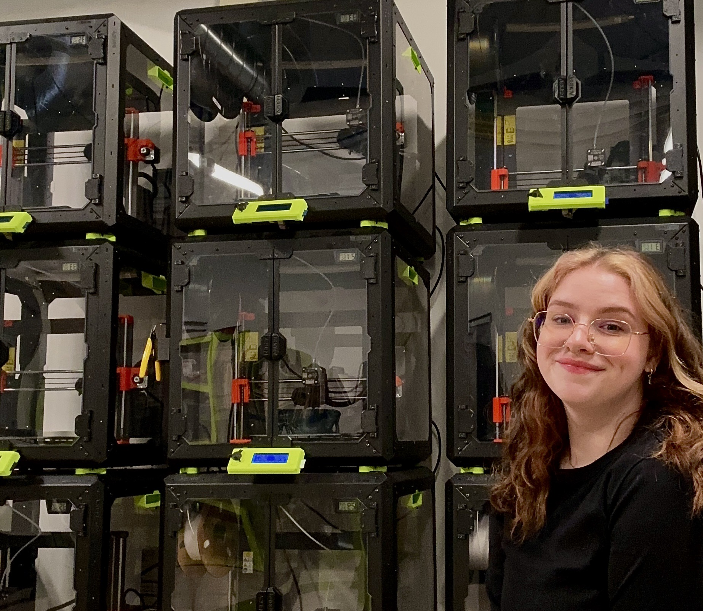

Kristen Holsworth is an Ypsilanti based artist that uses digital fabrication to create emotional objects. Through 3D printing and laser cutting she is able to make pieces that help her process memories and feeling, making objects that feel like part artifact, part daydream. 

Raised in the glow of early 2000s cartoons, clunky computers, sticker bombed CD players, and the hand me down influence of the 90s she works to preserve the nostalgia of growing up in a plastic, playful, awkward, and oddly tender world.
